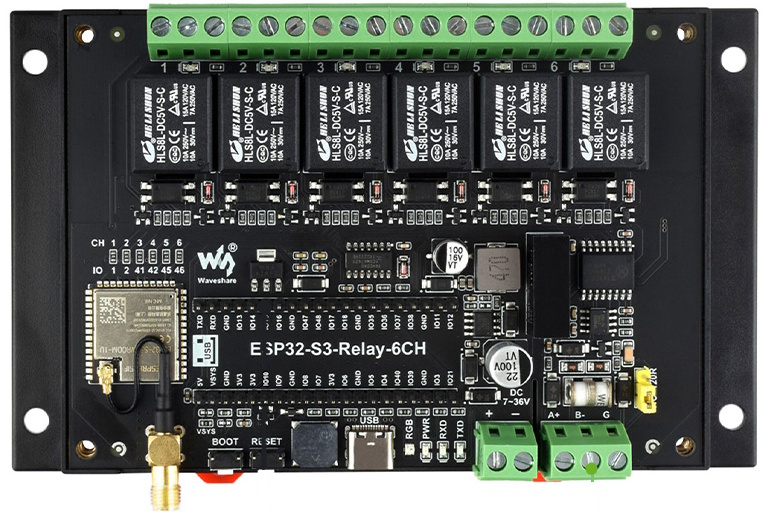

# ESPHome Configuration

This directory contains the ESPHome configuration for the pool controller based on the **Waveshare Industrial 6-channel ESP32-S3 Relay Module**.

**Hardware**: [Waveshare ESP32-S3-RELAY-6CH](https://www.waveshare.com/esp32-s3-relay-6ch.htm)

## Configuration Files

### Main Configuration

**`pool-controller.yaml`** - The primary ESPHome configuration file that defines:
- Device identification and platform (ESP32-S3 with ESP-IDF framework)
- GPIO pin assignments for all connected components
- WiFi, API, OTA, and web server configuration
- External component integration (custom_web_handler)
- Package includes for modular configuration
- Web server setup with custom endpoints

**Key Pin Assignments:**
- `waterfall_pin: GPIO1` - Waterfall relay control (Relay CH1)
- `one_wire_pin: GPIO10` - Dallas temperature sensors (air & water)
- `pentair_tx_pin: GPIO17` - RS485 transmit to pump/chlorinator (built-in RS485)
- `pentair_rx_pin: GPIO18` - RS485 receive from pump/chlorinator (built-in RS485)
- `pentair_light_pin: GPIO46` - Pentair IntelliBrite light control (Relay CH6)

### Include Files

The configuration is modularized into separate YAML files in the `Include/` directory:

#### **`temperature.yaml`**
Configures Dallas DS18B20 temperature sensors on a 1-Wire bus:
- Air temperature sensor
- Water temperature sensor
- Fahrenheit conversion templates
- 120-second update interval for sensor readings

#### **`schedule.yaml`**
The most complex configuration file, handling:
- Pentair IntelliFlo pump and IntelliChlor chlorinator communication (via pentair_if_ic component)
- UART configuration for RS485 communication
- Pump status monitoring and control
- Automated scheduling system with 6 configurable time periods
- Pump speed configuration (RPM settings)
- Waterfall relay control and automation
- Automation enable/disable controls
- Extensive state management for scheduling logic

#### **`chlorinator.yaml`**
Pentair IntelliChlor salt water chlorinator integration:
- Salt level monitoring (PPM)
- Chlorinator water temperature reading
- Chlorinator status and error reporting
- Output percentage monitoring
- Flow and low salt alarms
- Uses the pentair_if_ic custom component

#### **`pentair_light.yaml`**
Pentair IntelliBrite pool light control:
- 14 color/mode selections via power cycling
- Mode tracking and persistence
- Cycling logic to reach desired mode
- Select entity for mode choice (Party, Romance, Caribbean, American, Sunset, Royalty, Blue, Green, Red, White, Magenta, Hold, Recall)
- Light on/off control

## Wiring Diagram

### Waveshare ESP32-S3-RELAY-6CH Connections

```
┌───────────────────────────────────────────────────────────────────────────┐
│     Waveshare ESP32-S3-RELAY-6CH Industrial Module                        │
│     [Product Image: https://www.waveshare.com/esp32-s3-relay-6ch.htm]     │
│                                                                           │
│  ┌────────────────────────────────────────────────────────────────────┐   │
│  │ RELAY OUTPUTS (10A 250VAC / 30VDC each channel)                    │   │
│  │ ┌─────┐  ┌─────┐  ┌─────┐  ┌─────┐  ┌─────┐  ┌──────┐              │   │
│  │ │ CH1 │  │ CH2 │  │ CH3 │  │ CH4 │  │ CH5 │  │ CH6  │              │   │
│  │ │GPIO1│  │GPIO2│  │GPIO3│  │GPIO4│  │GPIO5│  │GPIO46│              │   │
│  │ └──┬──┘  └─────┘  └─────┘  └─────┘  └─────┘  └───┬──┘              │   │
│  │    │                                             │                 │   │
│  │    │ Screw Terminals (NO/COM/NC per channel)     │                 │   │
│  │    └──> Waterfall Valve        Pool Light <──────┘                 │   │
│  │         (24V AC)               (12V AC)                            │   │
│  │         Uses COM & NO          Uses COM & NO                       │   │
│  └────────────────────────────────────────────────────────────────────┘   │
│                                                                           │
│  ┌────────────────────────────────────────────────────────────────────┐   │
│  │ BUILT-IN ISOLATED RS485 INTERFACE (Lower Right)                    │   │
│  │                                                                    │   │
│  │  Screw Terminal Connections:                                       │   │
│  │  ┌─────┐                                                           │   │
│  │  │ A+  │ ──┐                                                       │   │
│  │  │ B-  │ ──┼──> To Pentair RS485 Bus                               │   │
│  │  │ G   │ ──┘    (Pump + Chlorinator)                               │   │
│  │  └─────┘                                                           │   │
│  │                                                                    │   │
│  │  Internal Connection: GPIO17 (TX), GPIO18 (RX)                     │   │
│  │  Hardware Automatic Direction Control                              │   │
│  │  Isolated with TVS Diode Protection                                │   │
│  └────────────────────────────────────────────────────────────────────┘   │
│                                                                           │
│  ┌────────────────────────────────────────────────────────────────────┐   │
│  │ GPIO CONNECTIONS (via 40-pin Pico HAT header)                      │   │
│  │                                                                    │   │
│  │  GPIO10 ──> Dallas 1-Wire Bus (with 4.7kΩ pullup to 3.3V)          │   │
│  │             ├─> Air Temperature Sensor (DS18B20)                   │   │
│  │             └─> Water Temperature Sensor (DS18B20)                 │   │
│  └────────────────────────────────────────────────────────────────────┘   │
│                                                                           │
│  Power Supply: USB Type-C (5V) or Screw Terminal (7-36V DC)               │
└───────────────────────────────────────────────────────────────────────────┘

EXTERNAL CONNECTIONS:

┌──────────────────────────────────────────────────────────────────┐
│  RS485 BUS (Connected to Module's A+, B-, G terminals)           │
│                                                                  │
│      Module RS485                                                │
│       A+ ────┬────────────────────────────┐                      │
│       B- ────┼────────┐                   │                      │
│       G  ────┼────┐   │                   │                      │
│              │    │   │                   │                      │
│              │    │   │                   │                      │
│         ┌────▼────▼───▼────┐         ┌────▼─────────────┐        │
│         │ Pentair          │         │ Pentair          │        │
│         │ IntelliFlo Pump  │         │ IntelliChlor     │        │
│         │                  │         │ Chlorinator      │        │
│         │ A+, B-, Ground   │         │ A+, B-, Ground   │        │
│         └──────────────────┘         └──────────────────┘        │
│                                                                  │
│  Note: Module has built-in isolation and surge protection        │
└──────────────────────────────────────────────────────────────────┘

┌──────────────────────────────────────────────────────────────────┐
│  DALLAS TEMPERATURE SENSORS (1-Wire on GPIO10)                   │
│                                                                  │
│   Each DS18B20 Sensor Wiring:                                    │
│   ┌─────────────┐                                                │
│   │  DS18B20    │                                                │
│   │             │                                                │
│   │  VCC ────> 3.3V (from Pico header)                           │
│   │  DATA ───> GPIO10 (via 40-pin header)                        │
│   │  GND ────> GND                                               │
│   └─────────────┘                                                │
│                                                                  │
│   Required: 4.7kΩ pullup resistor between DATA and VCC           │
│                                                                  │
│   Two sensors connected in parallel:                             │
│   - Air Temperature (Address: ${air_temp_id})                    │
│   - Water Temperature (Address: ${water_temp_id})                │
└──────────────────────────────────────────────────────────────────┘

┌──────────────────────────────────────────────────────────────────┐
│  RELAY CONNECTIONS                                               │
│                                                                  │
│  CH1 (GPIO1) - Waterfall Valve:                                  │
│  ┌──────────────────────────────────┐                            │
│  │  AC Line ──> COM                 │                            │
│  │  NO ──> Waterfall Valve ──> AC N │                            │
│  │  NC - Not Used                   │                            │
│  └──────────────────────────────────┘                            │
│                                                                  │
│  CH6 (GPIO46) - Pentair IntelliBrite Pool Light:                 │
│  ┌──────────────────────────────────┐                            │
│  │  AC Line ──> COM                 │                            │
│  │  NO ──> Pool Light ──> AC Neutral│                            │
│  │  NC - Not Used                   │                            │
│  │                                  │                            │
│  │  Note: Power cycling this relay  │                            │
│  │  changes light modes (14 modes)  │                            │
│  └──────────────────────────────────┘                            │
│                                                                  │
│  CH2-CH5: Available for expansion                                │
│  (Additional pumps, heater, valves, etc.)                        │
└──────────────────────────────────────────────────────────────────┘
```

### Component Summary

| Component | Connection Type | Pin/Relay | Notes |
|-----------|----------------|-----------|-------|
| **Waterfall Valve** | Relay CH1 | GPIO1 | 10A 250VAC relay switching |
| **Pool Light** | Relay CH6 | GPIO46 | Power cycling for 14 modes |
| **Pentair IntelliFlo Pump** | Built-in RS485 | GPIO17/18 | Via onboard isolated RS485 (A+, B-, G) |
| **Pentair IntelliChlor** | Built-in RS485 | GPIO17/18 | Shared RS485 bus with pump |
| **Air Temperature** | 1-Wire (Dallas) | GPIO10 | DS18B20 sensor, needs 4.7kΩ pullup |
| **Water Temperature** | 1-Wire (Dallas) | GPIO10 | DS18B20 sensor (same bus as air) |

### Notes

- The Waveshare module has 6 relay channels (10A 250VAC each). Currently using:
  - **CH1 (GPIO1)**: Waterfall valve control
  - **CH6 (GPIO46)**: Pool light control
  - **CH2-CH5**: Available for expansion (heater, auxiliary pumps, valves, etc.)
- **Built-in RS485**: The module includes an isolated RS485 interface with automatic direction control, TVS diode protection, and hardware isolation - no external converter needed
- The RS485 terminals (A+, B-, G) are located on the lower right of the module
- Optional 120Ω termination resistor can be enabled via onboard jumper
- The 1-Wire temperature bus requires a 4.7kΩ pullup resistor between DATA and VCC
- Pool light uses power cycling to select modes; ensure relay can handle inrush current
- Power supply options: USB Type-C (5V) or screw terminal (7-36V DC wide range)
- All GPIO connections via the 40-pin Pico HAT compatible header

## Getting Started

1. Update `secrets.yaml` with your WiFi credentials, API keys, and Dallas sensor addresses
2. Modify pin assignments in `pool-controller.yaml` if using different GPIO pins
3. Compile and upload using ESPHome CLI or Home Assistant ESPHome integration
4. Access the web interface at `http://pool-controller.local` or the device's IP address
5. View the custom dashboard at `http://pool-controller.local/custom_page`

## Dependencies

This configuration requires:
- ESPHome 2025.9.0 or newer
- Custom components:
  - `custom_web_handler` - Custom web endpoint handler
  - `pentair_if_ic` - Pentair IntelliFlo and IntelliChlor communication

See the [components README](../components/README.md) for installation instructions.
